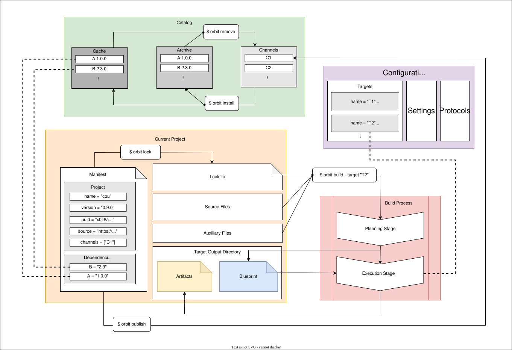
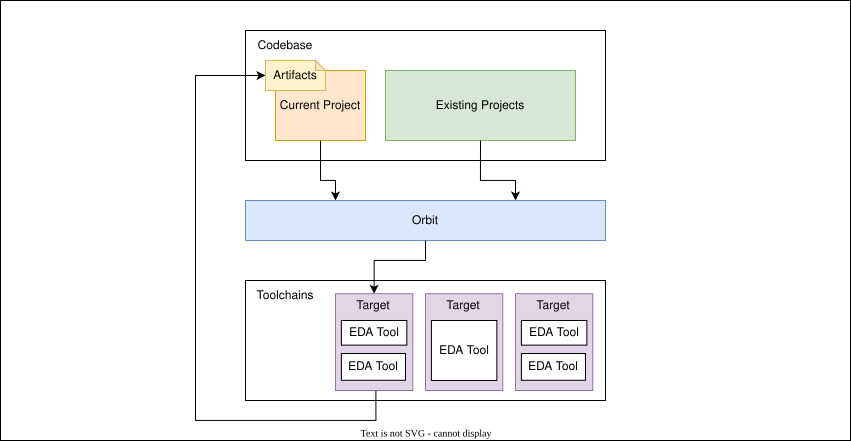
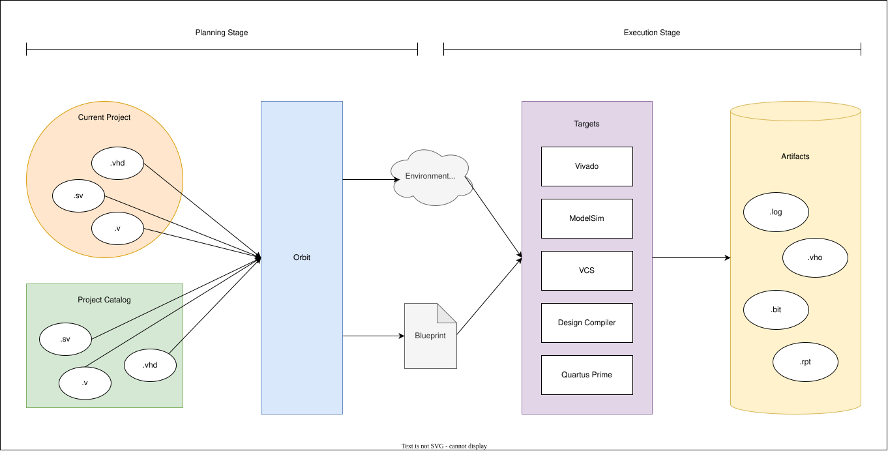

# Orbit

[](https://github.com/chaseruskin/orbit/actions) 
[](https://chaseruskin.github.io/orbit) 
[](https://www.gnu.org/licenses/gpl-3.0) 
[](https://hub.docker.com/repository/docker/chaseruskin/orbit/general) 
[](https://github.com/chaseruskin/orbit/releases)

Orbit is a package manager and build system for VHDL, Verilog, and SystemVerilog. It accomplishes two goals:
1. Empower users to reuse IP cores
2. Provide an extensible infrastructure for users to automate their EDA workflows

The following diagram is a high-level system architecture of how Orbit is used to manage projects and automate build processes:


Orbit groups one or more source code files (`.vhd`, `.v`, `.sv`) into a higher-level organizational unit called a _project_. Orbit provides management capabilities at the project level, making projects the "package" in its package management.

Wondering what Orbit is and how it works? Check out the [Topic Overview](https://chaseruskin.github.io/orbit/topic/overview.html) for more details describing Orbit's system architecture and its key concepts.

Curious how to use Orbit in your own hardware development workflow? Check out the [User Overview](https://chaseruskin.github.io/orbit/user/overview.html) to see how Orbit can be used to accelerate every stage of the development cycle.

### An efficient package manager designed to minimize technical debt 

As codebases scale and increase in complexity, it becomes of upmost importance to have the right system in place to efficiently manage the increasing number of resources. Without the right system, the codebase can become bogged down by _technical debt_, leaving you stuck in yesterday's designs.

However, using just any package management system does not guarantee that technical debt is minimized. Poorly-designed package managers will simply shift the technical debt to different resources, while a well-designed package manager will minimize the overall amount of technical debt. With minimal technical debt, you can bring up tomorrow's hardware today. Orbit is __an efficient package manager designed to minimize technical debt.__

### An extensible build system designed to support any workflow

Hardware development involves many complex processes, from running simulations to generating bitstreams. Orbit simplifies the build process into two stages: planning and execution. Orbit performs the planning of a build by resolving all HDL source code dependencies to produce a single file listing the topologically sorted source file order. From here, Orbit invokes any user-configured target to execute and process the planned list of source files. By allowing users to add their own execution processes, Orbit is __an extensible build system designed to support any workflow.__

### Free and open source

Orbit is available free to use and open source to encourage adoption, contribution, and integration among the hardware community. We rely on the open source community for feedback and new ideas, while remaining focused on our design goals and principles.

Orbit's use case is targeted toward anyone interested in developing digital hardware; this includes industrial, academic, and personal settings. Create your next commerical product, university lab assignment, or personal project, using a tool that is tailored to today's advanced development processes.

Prebuilt binaries are available for Linux, MacOS, and Windows with no dependencies. Visit the [releases page](https://github.com/chaseruskin/orbit/releases) for the latest version. Working on a different platform? No problem, building from source is easy with [Cargo](https://doc.rust-lang.org/cargo/getting-started/installation.html), Rust's default package manager. Use docker? We have [docker images](https://hub.docker.com/repository/docker/chaseruskin/orbit/general) available too. See [Installing](https://chaseruskin.github.io/orbit/starting/installing.html) for complete details.

For more information on getting started and how to use Orbit in your workflow, check out [The Orbit Book](https://chaseruskin.github.io/orbit/).

## The Missing Layer of Abstraction

Orbit operates at the layer between your codebase (source code files) and your toolchains (custom EDA workflows). Without Orbit, codebases had to directly interface with EDA tools, often resulting in hard to maintain scripts and noninteroperable workflows across tools and projects.



With Orbit, a key layer of abstraction is introduced to manage your codebase within your filesystem as well as interface with your required toolchains. The interface between Orbit and your codebase is linked through adding a simple manifest file to your projects. The interface between Orbit and your toolchains only requires users to write a lightweight script called a _target_ that wraps your existing EDA tools into a defined workflow.

## Simple and intuitive to use

Orbit manages your project with the addition of two files: "Orbit.toml" and "Orbit.lock".

```
cpu/
├── Orbit.lock
├── Orbit.toml
├── rtl/
│   ├── ctrl.vhd
│   ├── datapath.v
│   └── top.vhd
└── sim/
    └── top_tb.sv
```

The "Orbit.toml" file is a simple TOML file maintained by the user that requires only a couple fields, such as the project's `name` and `version`, to get setup.

Filename: Orbit.toml
``` toml
[project]
name = "cpu"
version = "1.0.0"
uuid = "71vs0nyo7lqjji6p6uzfviaoi"

[dependencies]
gates = "2.0.0"
```

The "Orbit.lock" file is a detailed TOML file automatically maintained by Orbit that stores the complete list of resolved dependencies, including how to get them. This allows anyone to rebuild your project with the exact source code you had as well, even if the source code is distributed across repositories.

## Easy code integration

To encourage code reuse, Orbit includes commands tailored toward HDL development to integrate designs across projects. For example, Orbit can display HDL code snippets of existing design units to be instantiated within your local project.

This includes support for VHDL source code:
```
$ orbit get and_gate --project gates:2.0.0 --library --signals --instance
```
``` vhdl
library gates;

signal a : std_logic;
signal b : std_logic;
signal x : std_logic;

u_and_gate : entity gates.and_gate
  port map(
    a => a,
    b => b,
    x => x
  );
```

As well as support for Verilog/SystemVerilog source code:
```
$ orbit get or_gate --project gates:2.0.0 --signals --instance
```
``` systemverilog
logic a;
logic b;
logic x;

or_gate u_or_gate (
  .a(a),
  .b(b),
  .x(x)
);
```

Design units written in one language can also have their instantiation code displayed in a different language, such as the SystemVerilog instance of a VHDL entity.

## Extensible build system

Since Orbit focuses on efficiently managing the HDL source code and minimizing its associated technical debt, users have the power to add their own execution targets to the build process. This is achieved through a two-stage build sequence, where first Orbit plans the build by generating a single file, called a blueprint, that lists the topologically-sorted order of necessary source files. After planning the build, Orbit invokes the user's target to perform the execution process on the list of source files.



For a project with the following design hierarchy:
```
$ orbit tree top_tb
```
```
top_tb
└── top
    ├── datapath
    │   └── and_gate
    │       └── nand_gate
    └── ctrl
```

Orbit can generate the blueprint listing the order of required HDL source files, even across other projects:

Filename: blueprint.tsv
```
VHDL	gates	/users/chase/.orbit/cache/1pgjtja7i1rcf0i5-2.0.0/rtl/nand_gate.vhd
VHDL	gates	/users/chase/.orbit/cache/1pgjtja7i1rcf0i5-2.0.0/rtl/and_gate.vhd
VLOG	cpu	/users/chase/projects/cpu/rtl/datapath.v
VHDL	cpu	/users/chase/projects/cpu/rtl/ctrl.vhd
VHDL	cpu	/users/chase/projects/cpu/rtl/top.vhd
SYSV	cpu	/users/chase/projects/cpu/sim/top_tb.sv
```

Create a target by writing a script that reads Orbit's generated blueprint file and performs the backend processing with the EDA tools you prefer. Configure the target once, and use it across all future projects.

## Highlights

Some key features of Orbit are:

- Orbit acts as the intermediary between your source code and backend EDA tools, automating the upkeep process and minimizing technical debt as your codebase evolves over time

- Overcome namespace collisions, a problem inherent to VHDL and Verilog/SystemVerilog, with Orbit's novel algorithm that dynamically transforms conflicting design names called [_dynamic symbol transformation_](https://chaseruskin.github.io/orbit/topic/dst.html)

- By performing dynamic symbol transformation, multiple versions of the same design unit (or more broadly, design units given the same identifier) are allowed in the same build under [two simple constraints](https://chaseruskin.github.io/orbit/topic/dst.html#limitations)

- No longer worry about manually organizing a design unit's order of dependencies with Orbit's built-in ability to tokenize HDL source code and automatically identify valid references to other design units

- Reproduce results across any environment with Orbit through its automatic handling of lockfiles and checksums

- Supports VHDL, Verilog, and SystemVerilog hardware description languages

- Quickly navigate through HDL source code to read its inline documentation and review a design unit's implementation with Orbit's ability to jump to and display HDL code segments

- Integrate existing design units across projects faster than ever with Orbit's ability to display valid HDL code snippets for design unit instantiation, even across languages

- Explore your evolving codebase to identify the projects you need next with Orbit's ability to quickly search through known projects by filtering based on keywords, status, and name

- Keep your source code independent of vendor tools and avoid vendor lock-in with Orbit's vendor-agnostic interface to backend EDA tools

- Continue to use your preferred version control system (or none) due to Orbit's flexible approach to being version control system agnostic

- Review high-level design unit circuit tree hierarchies at the HDL level or project level

- Linux, MacOS, and Windows are fully supported with zero additional dependencies

- Docker images and GitHub Actions are available to support CI/CD workflows

- Manifest files only require a few user-defined fields to get setup

- Write a target for your preferred EDA tools once, and reuse across projects with Orbit's support for configuration files

And these are only a few of Orbit's features! Download Orbit and read its documentation to discover everything Orbit provides as a package manager and build system for VHDL, Verilog, and SystemVerilog.

## Installing

Orbit has prebuilt binaries for MacOS, Windows, and Linux. See the [releases page](https://github.com/chaseruskin/orbit/releases) to download the latest version, or build from source using [Cargo](https://doc.rust-lang.org/cargo/getting-started/installation.html), Rust's default package manager. See [Installing](https://chaseruskin.github.io/orbit/starting/installing.html) for more details on getting Orbit up and running.

## Documentation

Read [The Orbit Book](https://chaseruskin.github.io/orbit/) for comprehensive documentation composed of tutorials, user guides, topic guides, references, and command manuals.

Orbit brings a modern approach to hardware development that minimizes technical debt through its available commands related to code management and build automation:
```
Orbit is an hdl package manager and build system.

Usage:
    orbit [options] [command]

Commands:
    new                   create a new project
    init                  initialize a project from an existing directory
    info                  display information about a project
    read                  lookup hdl source code
    get                   display integration code for a unit
    tree                  show a dependency graph
    lock                  save the world state of a project
    test, t               run a test
    build, b              plan and execute a target
    clean                 remove the target directory
    doc                   generate a project's documentation
    publish               post a project to a channel
    search                browse the catalog
    install               store an immutable reference to a project
    remove                delete a project from the catalog
    env                   print orbit environment information
    config                modify configuration data

Options:
    --version             print version information and exit
    --upgrade             check for the latest orbit binary
    --license             print license information and exit
    --sync                synchronize configured channels
    --force               bypass interactive prompts
    --color <when>        coloring: auto, always, never
    --help, -h            print help information

Use 'orbit help <command>' for more information about a command.
```

## License

This program is free software distributed under the terms of the GNU General Public License version 3 or later. You may use, modify, and redistribute the program as you wish but if you distribute modifications you must preserve the license text and copyright notices, and also make the modified source code available to your users. 

See [LICENSE](./LICENSE).

## Sponsoring

If you find this tool useful, please consider sponsoring! This project got its inspiration from my first internship with NASA Glenn Research Center in 2021, and I have started working on this project in my spare time throughout my undergraduate, graduate, and professional career. Any donation amount is greatly appreciated.

## Contributing

See [CONTRIBUTING](./CONTRIBUTING.md).
