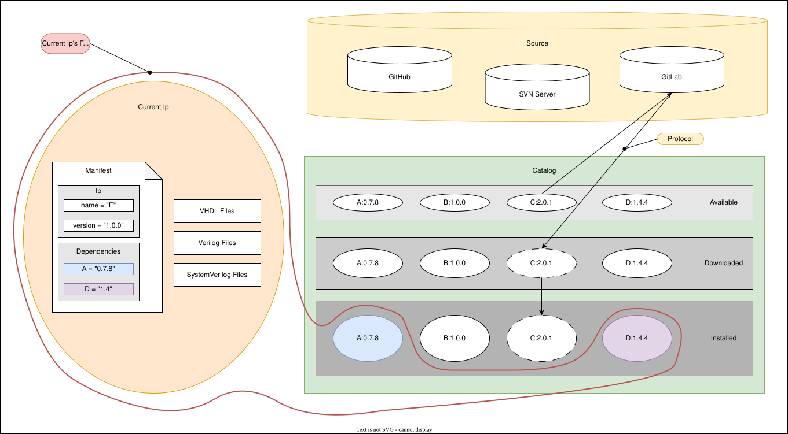

# Agile Ip Management

Orbit is designed for users to efficiently manage their ip and scale their codebase over time. Many of the processes regarding ip management are automated and abstracted away from the user, enabling them to get their next design done faster. This section takes a closer look at how the _catalog_ works in the context of Orbit and ip management. The catalog is a central concept to Orbit where existing ip are kept and maintained by Orbit.

## Catalog operations

The catalog is an abstract concept in Orbit where your existing ip are kept and maintained. Physically, the catalog is composed of a set of hidden directories in your file system found within the `$ORBIT_HOME` directory. Unless something has gone terribly wrong, users never have to worry about manually working within these directories; users interface with Orbit to request operations to be performed on the catalog. The two most fundamental catalog operations are: `install` and `remove`.

The `install` operation takes an existing ip, which may be from a local file path or a repository URL, and performs a series of steps to place an immutable reference of that ip in the catalog's _cache_. This operation is typically applied when you wish to make it possible for your current ip to depend on that other ip. If the ip is coming from a source, such as a GitLab repository, then a _protocol_ is used to handle how to download the ip's contents from the internet. Upon a successful download, a compressed backup of the ip's contents is stored in the catalog's _archive_. If the immutable reference in the cache ever enters an invalid state, Orbit automatically reinstalls the immutable reference from the compressed backup of the ip found in the archive.

The `remove` operation takes an ip found in the catalog's cache, and deletes it from the catalog's cache and archive (if exists). This operation is typically applied when you have determined that an ip is not needed anymore for any future ip. If the ip is still a dependency of other ips in the catalog, then the catalog will automatically reinstall the missing ip if required based on the current ip's complete ip dependency graph.

## Depending on ip

An ip's _field of view_ represents the set of HDL source code files that can interact with one another. A newly created ip's field of view starts out limited to the set of files found only within that ip. This means instantiations of modules and references to packages must be from primary design units located only within the HDL source code files of the current ip.

When a module, package, or any other design unit is needed from a different ip, users express their intention to depend on another ip within the current ip by adding the needed ip's name and version to the `[dependencies]` section of the current ip's manifest. By doing so, the current ip's field of view __expands__ to include the HDL source code files found directly within the dependent ip. This means instantiations of modules and references to other primary design units in the current ip's HDL source code can now include primary design units found in the dependent ip.

Depending on ip in the catalog is only allowed for ip that have an immutable reference located in the catalog's cache. An ip in the catalog only listed as _available_ or _downloaded_ does not have the necessary data to properly reference any HDL source code files from that ip. Thankfully, Orbit automatically works through the required steps to get an ip installed to the cache when the user requests an `install` operation, even if the ip is not found in the catalog.

## Important concepts

- The _source_ is the location where the ip's repository exists; this could be any cloud-based platform such as GitHub or GitLab where your repository is stored.

- The _catalog_ is an abstract concept in Orbit that maintains 3 levels: available ip (found in channels), downloaded ip (located in the archive), and installed ip (located in the cache).

- When an ip is known as _available_ in the catalog, Orbit only has the manifest and other metadata about that ip; there is no HDL source code for that ip in the catalog. The ip's manifest and metadata are tracked in a user-configured _channel_.

- When an ip is known as _downloaded_ in the catalog, Orbit has a compressed version of the ip's contents. In this state, the ip is unusable as a dependency. The compressed version of the ip is stored in the _archive_.

- When an ip is known as _installed_ in the catalog, Orbit has an uncompressed version of the ip's contents used for reference only. In this immutable state of the ip's contents, the ip is able to be used as a dependency. The immutable reference of the ip is kept in the _cache_.

- Users interact with the catalog through Orbit. Two fundamental catalog operations are: `install` and `remove`. The `install` operation brings an ip into a usable state in the catalog, while the `remove` operation takes an ip out of a usable state in the catalog.

- An ip's _field of view_ is the set of HDL source code files that can interact with one another. Each ip has its own field of view, which may extend to other ips not found in the current ip's field of view. By adding an ip as a dependency in the current ip's manifest, you effectively expand the current ip's field of view to include the set of HDL source code files found within the ip dependency.
