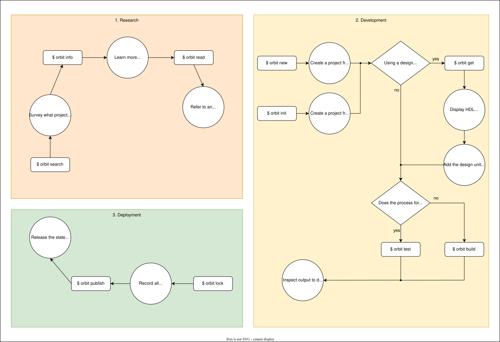

# How to Use Orbit

Orbit provides commands through the command-line interface to help at every stage in the hardware development cycle.

## Hardware development cycle

The hardware development cycle can be loosely divided into three main stages:

1. __Research/Planning__: Define a project's goals, scope, requirements, and identify any existing solutions that can be reused

2. __Design/Development__: Create the architecture, implement the system's functionalities, and verify the design meets the requirements through testing

3. __Deployment/Maintenance__: Release the project to the production environment to make it accessible to its users while providing ongoing updates, bug fixes, and new features over time

## Development process

### 1. Research

At the start of any project, it's important to survey existing work to identify any related projects that either already meet your requirements or can be used to help meet your requirements. 

- Orbit helps you quickly survey what projects exist in the ip catalog with `orbit search`. This will return a list of all projects available in the ip catalog, their latest version, their status (installed, downloaded, available), and its unique identifier.

- Further refining your search to get more information about a particular project can be done with `orbit info`. This command can display data pulled from the ip's manifest, what design units it contains, the different versions of the project, and other data related to that project.

- After finding a design unit of interest within a particular project, a reference to that design unit's source code can be made available with `orbit read`. If the source code is well-documented and written in a clear manner, then this referring to the source code can help easily understand if using this particular design unit will be able to help you in your next project.

 > __Tip__: The read operation works especially well with a command-line pager such as `less`, allowing the source code contents to be easily navigated by piping it as input to the pager.

### 2. Development

The bulk of time and resources for any project takes place during the development stage. In this stage, the project's architecture is created, the system's functionalities are implemented, and checked to make sure they meet the project's requirements through testing.

- Using any design units from existing ip in your latest project can be quickly achieved using `orbit get`. This command will return the necessary HDL code snippets to correctly instantiate a design unit. Simply adding the external ip's name and version to the current project's `[dependencies]` table within the `Orbit.toml` file will allow Orbit to record the information necessary to correctly reference the design unit's within that ip.

- Running a build process on a new design unit that does not require a testbench can be achieved with `orbit build`. By configuring and specifying a target, this command gives you the power to run any particular workflow for your set of tools and unique demands, such as performing synthesis.

- Running a build process to verify a new design unit with its accompanied testbench can be achieved with `orbit test`. This command requires the user to configure and specify a target similiar to `orbit build`, but under the intention that a testbench is required, perhaps for running a simulation.

### 3. Deployment

After a project has been successfully developed and meets its specified goals and requirements, it can be deployed to its production environment and made available to its users.

- A detailed record of how to reproduce the project using Orbit can created with `orbit lock`. This command will generate a lockfile, `Orbit.lock`, which saves all the information about the current project and its dependencies such that the exact state of the project can be reproduced at a later time in any environment.

- Securing the current state of the project as a release (such as version 1.0.0) for others to find is done using `orbit publish`. This command verifies the current project's state is valid in the context of Orbit and then installs it to your local ip catalog as well as posts its manifest to any of its configured channels. By posting the ip to a channel, any other users who also have the same channel configured will be able to see the newly available project.

And with that, the cycle continues. As new features, bug fixes, and improvements are brought forth over time, users can repeat the following process to produce another release for any given project.
